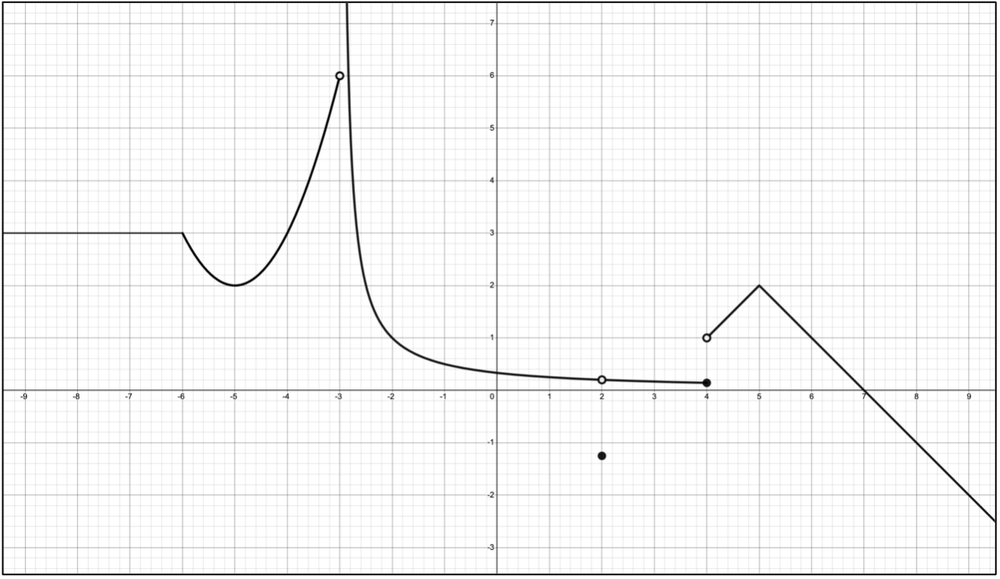

[comment]: render
# Day 6 -- "Catch up"

1.  Find the average rate of change of $f(t)$ between $t = 20\ min$ and $t = 30\ min$. Then find the instantaneous rate of change of $f(t)$ at $t = 24\ min$.

  ----------------------------------------------------------------------------
  $$t$$      20         22         24         26         28         30
  ---------- ---------- ---------- ---------- ---------- ---------- ----------
  $$f(t)$$   5          7          11         18         29         45

  ----------------------------------------------------------------------------

  * * *

2.  Approximate the instantaneous velocity of $g(x) = \frac{e^{x} + 1}{x - 2}$ at $g(3)$. Explain the steps you used.

  * * *

3. Find the equation of the tangent line to the function $f(x)=\sqrt{x-2}$ at $x-4$.

4. Find all vertical and horizontal asymptotes for the function $g(x) = \frac{x - 2}{x^{3} - 8}$ . Show all work and use limits as appropriate.

  * * *

5. Find the following limits:

    a.  $\lim_{x \rightarrow \frac{\pi}{2}^{-}}\frac{|cos(x)|}{x - \frac{\pi}{2}}$

    b.  $\lim_{x \rightarrow 2}\frac{\frac{3}{x - 1} - 3}{x - 2}$

    c.  $\underset{x \rightarrow \ 1\ \ \ }{lim\ }{\sin^{- 1}(2x - 1)}$

    d.  $\underset{x \rightarrow \ 1\ \ \ }{lim\ }{{sin}^{- 1}\left( {2x - x}^{2} \right)}$

  * * *

6. Sketch a possible function with the given characteristics:

    a.  $\lim_{x \rightarrow 1}{f(x) \neq f(x)}$

    b.  $\lim_{x \rightarrow - 5}{f(x) = d.n.e.}$

    c.  $\lim_{x \rightarrow \infty}{f(x) = 3}$

    d.  $f( - 1)$ is undefined

    e.  $\lim_{x \rightarrow 4^{+}}{f(x) = 1}$

    f.  $\lim_{x \rightarrow 4^{-}}{f(x) = - \infty}$

\pagebreak 

7. Use the graph of $f(x$) to answer the questions below it.

  

a.  $\lim_{x \rightarrow - 3^{-}}{f(x) = \_\_\_\_\_\_\_\_\_\_}$

b.  $\lim_{x \rightarrow - 3^{+}}{f(x)} = \_\_\_\_\_\_\_\_\_\_$

c.  $\lim_{x \rightarrow - 3}{f(x) = \_\_\_\_\_\_\_\_\_\_}$

d.  $\lim_{x \rightarrow 2^{-}}{f(x)}\  = \_\_\_\_\_\_\_\_\_\_$

e.  $\lim_{x \rightarrow 2^{+}}{f(x) = \_\_\_\_\_\_\_\_\_\_}$

f.  $\lim_{x \rightarrow 2}{f(x) = \_\_\_\_\_\_\_\_\_\_}$

g.  $\lim_{x \rightarrow \infty}{f(x)} = \_\_\_\_\_\_\_\_\_\_$

h.  $\lim_{x \rightarrow - \infty}{f(x) = \_\_\_\_\_\_\_\_\_\_}$

  

i.  $f(x)$ has jump discontinuity at: \_\_\_\_\_\_\_\_\_\_\_\_\_\_\_\_\_\_\_\_\_\_\_\_\_\_\_\_\_\_\_\_\_\_

j.  $f(x)$ has infinite discontinuity at: \_\_\_\_\_\_\_\_\_\_\_\_\_\_\_\_\_\_\_\_\_\_\_\_\_\_\_\_\_\_\_\_\_\_

k.  $f(x)$ has removable discontinuity at: \_\_\_\_\_\_\_\_\_\_\_\_\_\_\_\_\_\_\_\_\_\_\_\_\_\_\_\_\_\_\_\_\_\_

l.  The horizontal asymptotes of $f(x)$ are: \_\_\_\_\_\_\_\_\_\_\_\_\_\_\_\_\_\_\_\_\_\_\_\_\_\_\_\_

m.  The vertical asymptotes of $f(x)$ are: \_\_\_\_\_\_\_\_\_\_\_\_\_\_\_\_\_\_\_\_\_\_\_\_\_\_\_\_

\pagebreak 

8. Find $k$ so that $f(x)$ is continuous for all real numbers, given:

$$f(x) = \left\{ \begin{aligned}
e^{x},\ \  & x > 0 \\
 - (x + 1)^{2} + k,\ \  & x \leq 0 \\
\end{aligned} \right.\ $$

  * * *
 
9. Find: $\lim_{x \rightarrow 0}{\ \left( \ln{(\tan^{2}x)} \right) = \_\_\_\_\_\_\_\_\_\_}$

  * * *

10. #37 from 2.4 Homework:

> Use the Intermediate Value Theorem (IVT) to show that there is a root of the given equation in the specified interval. $x^{4} + x - 3 = 0\ \ on\ (1,2)$

  * * *

11. #39 from 2.4 Homework:

> Use the Intermediate Value Theorem (IVT) to show that there is a root of the given equation in the specified interval. $\cos x = x\ \ on\ (0,1)$

