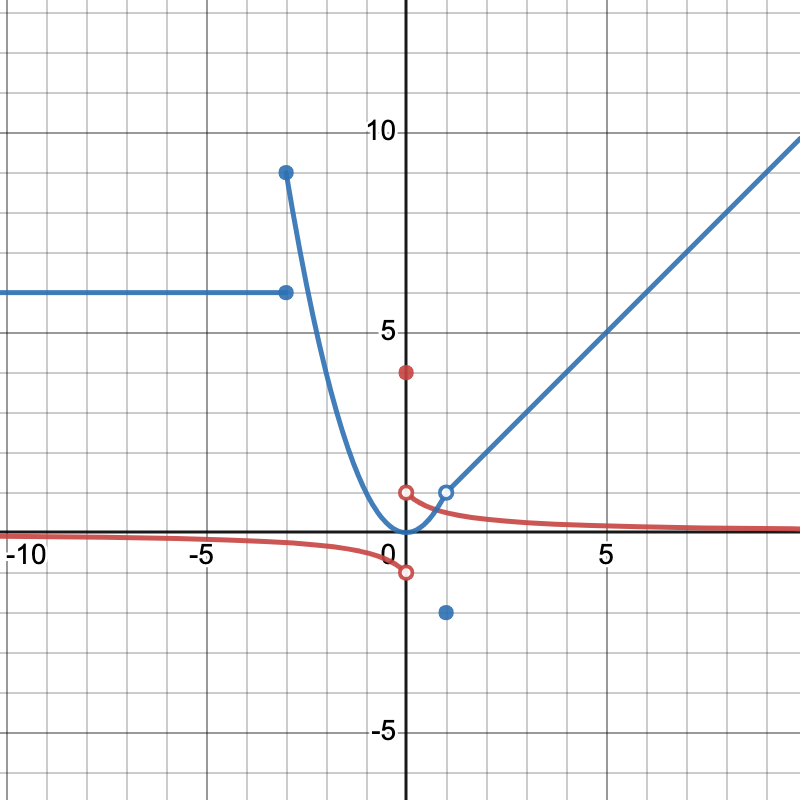

[comment]: render
# Day 07 More Review
## Limits are FUN!

1. In the graph below you will see information about $f$ in red and $g$ in blue. 

Answer these questions about the product function $(fg)(x)$.

A. $\lim\limits_{x \rightarrow 0} (fg)(x)$

B. $\lim\limits_{x \rightarrow  - \infty} (fg)(x)$

C. $\lim\limits_{x \rightarrow  -3} (fg)(x)$

D. Identify the places that $fg$ has a discontinuity, and describe which kind of discontinuity (there 3 to choose from).

E. Explain why we don't know $\lim_{x \rightarrow   \infty} fg(x)$. Given that $g(x)=x$ for $x>1$, give at least two examples of possible 
formulas for $f(x)$ on the domain $x>0$ that would lead to different results for $\lim_{x \rightarrow   \infty} fg(x)$.

E. What is $(fg)(0)$. 

2. More fun with limits....

A. $\lim\limits_{x \rightarrow  - \infty} \frac{1-3x}{\sqrt{x^{2}+6x-8}}$

B. $\lim\limits_{x \rightarrow  4} \frac{3x+1}{4+6^{\frac{-1}{(x-4)^{2}}}}$

C. $\lim\limits_{x \rightarrow 8} \sin( \pi \frac{ |x-8 | }{x-8})$

3. Continuity... 

A. Write an expression for a function that has a jump discontinuity at $x=3$.

B. Write an expression for a function that has a removable discontinuity at $x=0$.

C. Is it possible for a function to not be defined at a value for $x$ and the function still be continuous at that value?

D. Is it true that a function that is continuous on the right at $x=3$ and continuous on the left at at $x=3$ is continuous 
on at $x=3$

4. Tangent lines

A. Find the tangent line to the graph of $f(x)= \sqrt{x}$ at $x=4$. 

B. Because the tangent line and the function are close together (at least for a little while), you can 
use them to make estimates for values that would be hard to compute by hand. 
Use the equation of the tangent line to find an estimate for $\sqrt{4.2}$. 

C. Compare your estimate with value given by a calculator. How close are the two values?