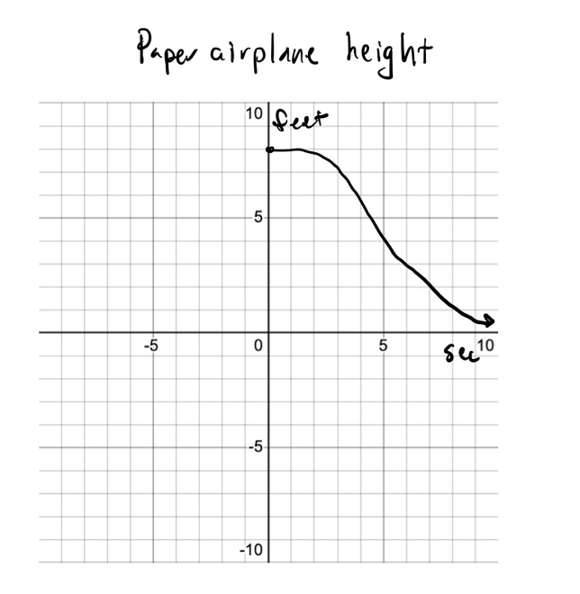
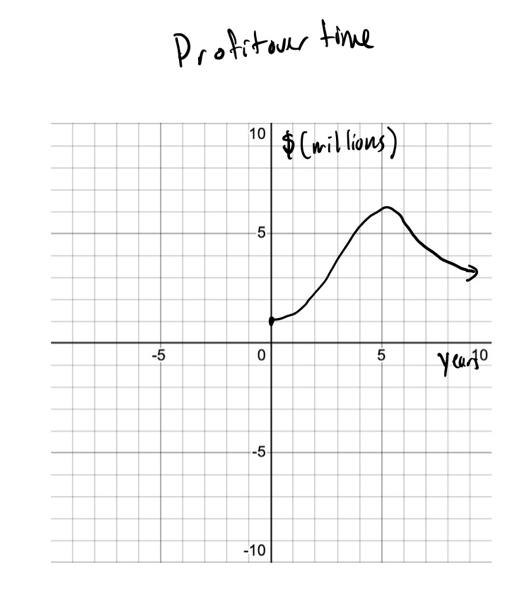
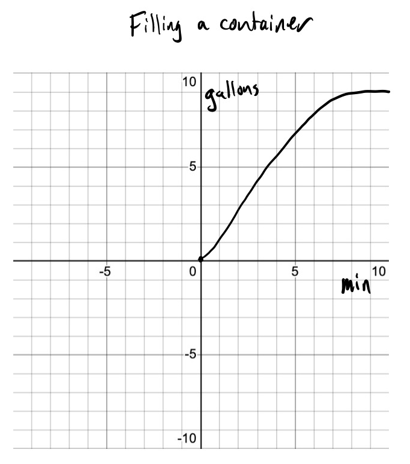
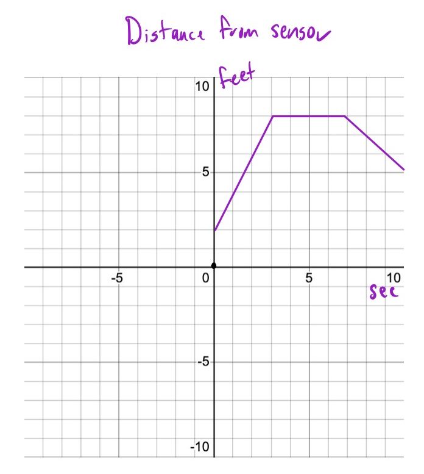
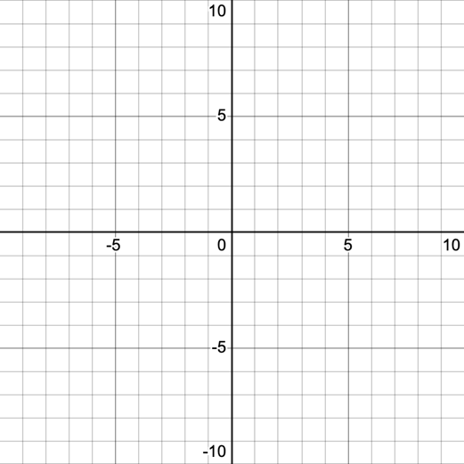
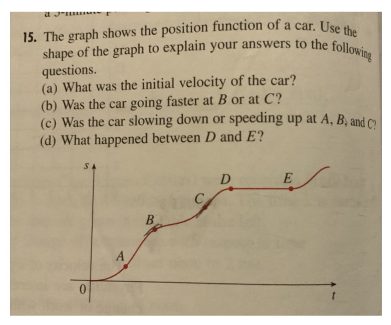
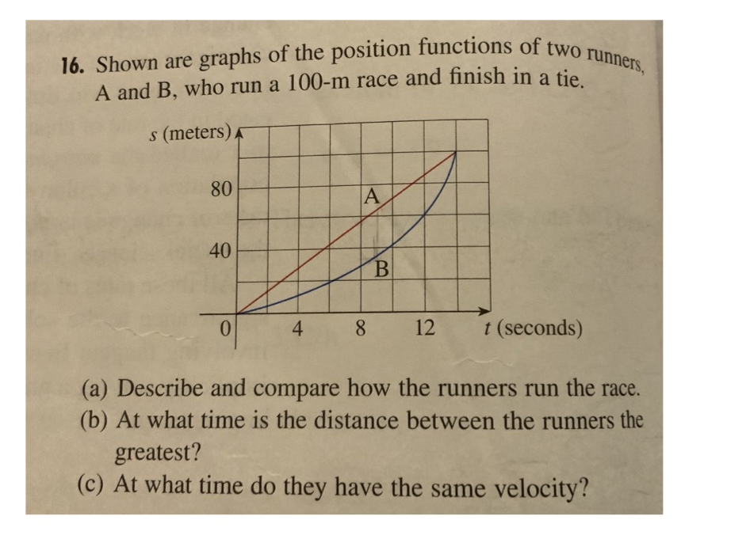

[comment]: render
# MA 507
## Chapter 2 Section 6

### Opener

Calculate these limits:

A.  $\lim_{x \rightarrow 1}\frac{x^{2} - 5x + 4}{x - 1}$

B.  $\lim_{x \rightarrow 2}\frac{\sqrt{x + 7} - 3}{x - 2}$ (hint: use
    the conjugate)

C.  $\lim_{h \rightarrow 0}\frac{{(2 + h)}^{2} - 4}{h}$

In each of the graphs below write the units for slope:

{width="2.928993875765529in"
height="2.9960695538057744in"}

{width="2.4166666666666665in"
height="2.6798611111111112in"}

{width="2.180439632545932in"
height="2.4626148293963253in"}

### Instantaneous Rates of Change

The instantaneous rate of change of a function is measured by the
\_\_\_\_\_\_\_\_\_\_\_\_\_\_\_\_\_\_\_\_\_\_\_. The
\_\_\_\_\_\_\_\_\_\_\_\_\_\_\_\_\_\_\_\_\_\_\_\_\_\_ is computed by
doing a \_\_\_\_\_\_\_\_\_\_\_\_\_\_\_\_\_\_. There are 2 versions of
this \_\_\_\_\_\_\_\_\_\_\_\_\_\_\_\_\_\_\_\_.

a\.

b\.

Find the slope of $f(x) = x^{2} - 2x$ at $x = 2$ using both definitions:

a\.

b\.

### DESMOS BREAK

A motion sensor is tracking the position of person in terms of distance
from the sensor. Use the graph below to describe the motion of the
individual in words. Be sure to include descriptions of the velocity of
the individual.

{width="2.0121555118110237in"
height="2.2434372265966753in"}

Draw a graph of the velocity function

{width="2.3609470691163605in"
height="2.3609470691163605in"}

{width="5.375in"
height="4.472222222222222in"}

a\.

b\.

c\.

d\.

{width="6.5in" height="4.809722222222222in"}

a\.

b\.

c\.

Calculate the tangent line to the function $f(x) = x^{2} - 3x + 5$ at
$x = 3$. What version of the equation of a line will you use (slope
intercept/standard/point-slope)?
