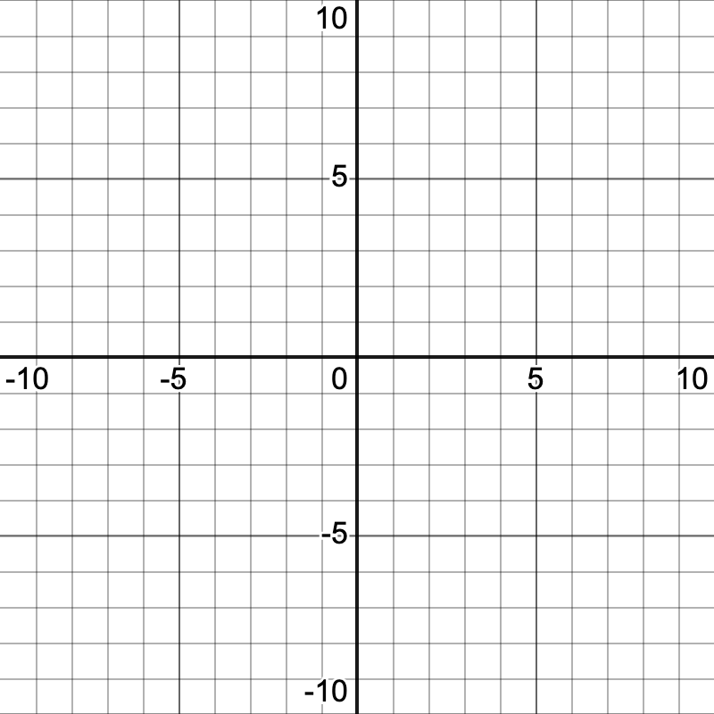

[comment]: render

# Day 3 - Section 2.4

Notes:

What do these graphs have in common, what is unique about each one?

{width="2.8047331583552055in"
height="2.8047331583552055in"} {width="2.804734251968504in"
height="2.804734251968504in"}

{width="2.7927066929133857in"
height="2.7927066929133857in"} {width="2.810650699912511in"
height="2.810650699912511in"}

Let's make a definition:

Three kinds of discontinuities:

**Removable:**

&nbsp;  
&nbsp;  

**Infinite:**

&nbsp;  
&nbsp;  

**Jump:**

&nbsp;  
&nbsp;  

Draw a graph on the grid below of a function with domain (-5,5\], a jump
discontinuity at x=-2, and a removable discontinuity at x=3.

{width="3.5325437445319334in"
height="3.5325437445319334in"}

**\
**

**Definition of Continuity from the left and the right:**

&nbsp;  
&nbsp;  
&nbsp;  

**Types of functions that are continuous:**

&nbsp;  
&nbsp;  
&nbsp;  

**Continuity makes limits easier**

&nbsp;  
&nbsp;  
&nbsp;  

**Intermediate Value Theorem**

&nbsp;  
&nbsp;  
&nbsp;  

Sketch the graph of each function. Use the graph to determine if it is
continuous everywhere, or sometimes discontinuous. If there is a
discontinuity identify where it is, and describe it as removable,
infinite, or jump.

{width="3.5319444444444446in"
height="3.5319444444444446in"}

1.  $f(x) = \left\{ \begin{matrix}
    e^{x} & x < 0 \\
    x^{2} & x \geq 0 \\
    \end{matrix} \right.\ $

{width="3.5319444444444446in"
height="3.5319444444444446in"}

2.  $f(x) = \left\{ \begin{matrix}
    \sqrt[3]{x} & x \neq 2 \\
     - 3 & x = 2 \\
    \end{matrix} \right.\ $

{width="3.5319444444444446in"
height="3.5319444444444446in"}

3.  $f(x) = \frac{1}{x - 3}$

{width="3.5319444444444446in"
height="3.5319444444444446in"}

4.  $f(x) = (x - 3)(x + 1)(x + 4)$

5.  $f(x) = \left\{ \begin{matrix}
    \sin x & x < 0 \\
    x^{3} & x \geq 0 \\
    \end{matrix} \right.\ $

{width="3.5319444444444446in"
height="3.5319444444444446in"}

6.  What value of $a$ makes the function $g(x) = \left\{ \begin{matrix}
    3x - 1 & x < 2 \\
    x + a & x \geq 2 \\
    \end{matrix} \right.\ $ continuous everywhere?

7.  Use the intermediate value theorem to show that
    $f(x) = x^{3} - 3x^{2} + 4$ has a zero.
